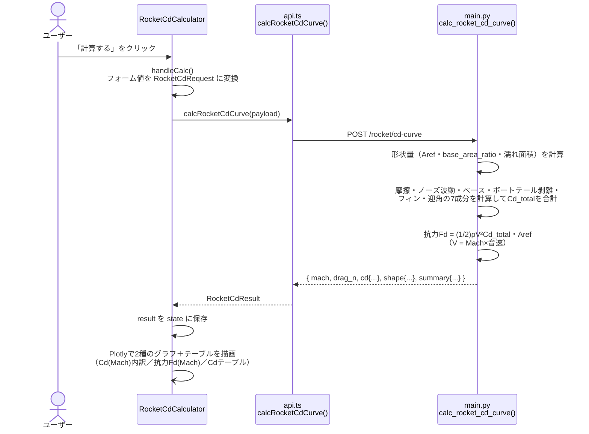

# Cd計算（Cd計算タブ）計算ロジック

対象: `Cd計算` タブ（[Dashboard.tsx](frontend/app/components/Dashboard.tsx) の `tab === 'rocket-cd'`）。
[RocketCdCalculator.tsx](frontend/app/components/RocketCdCalculator.tsx) が画面全体を構成する。

元ネタは `cd_calculator/rocket_cd_viewer.py`（Streamlit版）の簡易Cd(Mach)モデルを移植したもの。

| 処理 | 実行タイミング | 役割 |
| --- | --- | --- |
| 機体形状プロット（側面図・端面図） | フォーム入力の度に即時（クライアント側のみ、APIコール無し） | 形状パラメータからシルエットとフィン配置を描画 |
| 「計算する」ボタン | クリック時 | Cd(Mach)曲線・抗力Fd・濡れ面積等のサマリーをバックエンドで計算 |

---

## 1. 機体形状プロット（クライアント側、ライブ更新）

### 1.1 概要

形状パラメータが変わるたびに `computeLiveShape()`（[RocketCdCalculator.tsx:190](frontend/app/components/RocketCdCalculator.tsx#L190)）が
`useMemo` で再計算され、バックエンドを呼ばずに即座に再描画される。Cd(Mach)曲線とは独立しているため、
「計算する」を押す前でも形状だけは確認できる。

- ノーズ形状プロファイル: `noseProfileXR()`（[RocketCdCalculator.tsx:157](frontend/app/components/RocketCdCalculator.tsx#L157)）
- フィン投影（側面図・端面図）: `computeLiveShape()` 内のループ、`finPolygon()`（[RocketCdCalculator.tsx:282](frontend/app/components/RocketCdCalculator.tsx#L282)）

### 1.2 ノーズ形状プロファイル

先端 $x=0$ から根元 $x=L_n$ まで、ノーズ形状ごとに半径 $r(x)$ を計算する（$\xi = x/L_n$、$R$=胴体半径）。

| ノーズ形状 | 式 |
| --- | --- |
| Conical | $r = R\,\xi$ |
| Tangent ogive | $\rho = \dfrac{R^2+L_n^2}{2R}, \quad r = \sqrt{\rho^2-(L_n-x)^2} + R - \rho$ |
| Elliptical | $r = R\sqrt{1-\left(\dfrac{x-L_n}{L_n}\right)^2}$ |
| Parabolic | $r = R\,(2\xi-\xi^2)$ |
| Von Karman / Haack | $\theta=\arccos(1-2\xi), \quad r = R\sqrt{\dfrac{\theta-\frac12\sin 2\theta}{\pi}}$ |

胴体（円筒部）は半径 $R$ で一定。ボートテール（Boat tail）を選んだ場合は後端で半径が
$R_{base} = 0.5 \cdot D_b/D \cdot D$ まで直線的に絞られる。

### 1.3 側面図のフィン投影

フィン $N$ 枚を円周上に等間隔配置（$\varphi_i = \dfrac{2\pi i}{N}$、$i=0$ が側面図の真下基準）したと仮定し、
側面図（$x$–$r$平面）へは $\cos\varphi_i$ で正投影する。

$$
\text{span}_i = s \cdot |\cos\varphi_i|, \qquad \text{mirrored} = (\cos\varphi_i < 0)
$$

軸に直交するフィン（$|\cos\varphi_i|$ が小さい）は側面から見て幅ゼロになるため、閾値未満（0.03）は描画を省略する。
`mirrored=true` のフィンは胴体上側に、`false` は下側に描画する。

### 1.4 端面図（ノーズ側から見た図）のフィン配置

端面図はロケットの先端から胴体軸方向に見た図で、すべてのフィンが角度だけ変えて放射状に
フルスパンで見える（投影による短縮は無い）。フィン $i$ の向きベクトルは

$$
\vec{d_i} = (-\sin\varphi_i,\ -\cos\varphi_i)
$$

で、$\varphi_i=0$ のフィンが真下を向くように合わせている（側面図の基準フィンと一致）。
胴体半径 $0.5$（$r/D$）から $0.5+\text{span}_i$ まで伸びる薄い矢羽根として描画し、矢羽根の幅は
フィン厚 `fin_thickness_d`（最小0.02）を使う。

---

## 2. Cd(Mach)曲線・抗力計算（バックエンド、「計算する」ボタン）

### 2.1 概要

- フロント関数: `handleCalc()`（[RocketCdCalculator.tsx:304](frontend/app/components/RocketCdCalculator.tsx#L304)）
- API: `calcRocketCdCurve()`（[api.ts](frontend/app/lib/api.ts)）
- バックエンド: `POST /rocket/cd-curve` → `calc_rocket_cd_curve()`（[main.py:4245](backend/main.py#L4245)）

Mach配列 $M$（`mach_min`〜`mach_max` を `points` 点で等分割）に対し、Cdの7つの成分を計算して合計する。

### 2.2 形状量（濡れ面積・基準面積）

$$
A_{ref} = \pi R^2, \qquad
\text{base\_area\_ratio} = \dfrac{\max(R_{base}^2 - R_{nozzle}^2,\ 0)}{R^2}
$$

濡れ面積は回転体の側面積として数値積分（`_rocket_cd_surface_area_of_revolution()`、[main.py:4228](backend/main.py#L4228)）し、
胴体・ボートテールは円筒／円錐側面の closed-form、フィンは平面形面積×2×枚数で近似する。

### 2.3 摩擦抵抗（胴体＋ノーズ＋ボートテール、フィン）

$$
Re_D(M) = \text{clip}\big(Re_{D,M1} \cdot \max(M,\,0.05),\ 10^4,\ 10^9\big), \qquad
Re_L = Re_D \cdot \max\!\left(\frac{L_{total}}{D},\,1\right)
$$

$$
C_f = \frac{0.455}{(\log_{10} Re_L)^{2.58}} \times k_{rough}
$$

$$
Cd_{friction,body} = C_f \cdot \frac{S_{nose}+S_{body}+S_{boattail}}{A_{ref}}, \qquad
Cd_{friction,fins} = C_f \cdot \frac{S_{fins}}{A_{ref}}
$$

$Re_{D,M1}$（Re_D, Mach1時）はユーザー入力。$k_{rough}$ は表面仕上げ（Polished〜Rough）による係数（0.85〜1.65）。
Re数はMach数に比例してスケールする（一定高度＝大気条件固定を仮定した近似、詳細は
[backend/main.py:4234](backend/main.py#L4234) `_rocket_cd_turbulent_cf()`）。

### 2.4 ノーズ圧力・波動抵抗

$$
Cd_{nose} = k_{shape} \cdot \left(\frac{4}{\max(L_n/D,\,0.5)}\right)^{1.1}
\Big[\,0.085\,e^{-\left(\frac{M-1.05}{0.22}\right)^2} + 0.045\,S(M;1.15,0.10)\,\big(1-e^{-0.7\max(M-1,0)}\big)\Big]
$$

$k_{shape}$ はノーズ形状係数（Von Karman/Haackが最小0.62、Conicalが最大1.00）。$S(M;x_0,w)$ はロジスティック型の
スムーズステップ関数 `_rocket_cd_smooth_step()`（[main.py:4240](backend/main.py#L4240)）で、$M=1.05$ 付近の遷音速バンプと
$M>1.15$ の超音速立ち上がりを表現する。

### 2.5 ベース抵抗

$$
Cd_{base} = \text{base\_area\_ratio} \times \big[0.11+0.16\,S(M;0.80,0.12)\big] \times \big[1-0.25\,S(M;2.0,0.35)\big] \times k_{power}
$$

$k_{power}=0.35$（推力ON、排気プルームが後流の低圧域を緩和）または $1.0$（OFF）。

### 2.6 ボートテール剥離抵抗

$$
\theta_{taper} = \arctan\!\left(\frac{R-R_{base}}{L_{bt}}\right), \qquad
Cd_{boattail} = \frac{\max(\theta_{taper}-12^\circ,\ 0)}{100}
$$

ベース形状が Boat tail のときのみ計算（Flat baseは常に0）。テーパー角度12°を境界剥離の閾値とした経験的近似で、
Mach数には依存しない（全Mach点で同一値）。

### 2.7 フィン圧力・波動抵抗

$$
Cd_{fin,wave} = 0.015 \cdot \big(\text{フィン平面形面積比}\big) \cdot \big(1+2\,S(M;1.15,0.10)\big) \cdot \frac{t_f/D}{0.02}
$$

テーブル・凡例上の「フィン」列は $Cd_{friction,fins} + Cd_{fin,wave}$ の合計値。

### 2.8 迎角抗力

$$
Cd_{AoA} = 0.08 \cdot \frac{L_{total}\cdot D}{A_{ref}} \cdot \alpha^2 \qquad (\alpha = \text{迎角[rad]})
$$

Mach数に依存しない簡易二次近似。迎角0°（デフォルト）では常に0。

### 2.9 Cd合計と抗力Fd

$$
Cd_{total} = Cd_{friction,body} + Cd_{friction,fins} + Cd_{nose} + Cd_{base} + Cd_{boattail} + Cd_{fin,wave} + Cd_{AoA}
$$

$$
V = M \cdot a, \qquad F_d = \frac{1}{2}\,\rho\,V^2\,Cd_{total}\,A_{ref}
$$

$\rho$（空気密度）・$a$（音速）はユーザー入力（デフォルトはISA海面標準大気値 $\rho=1.225\ \text{kg/m}^3$,
$a=340.3\ \text{m/s}$）。高度による$\rho$・$a$の変化は考慮しない簡易近似で、$Cd$自体（摩擦計算のRe数）とは
独立したパラメータ。

### 2.10 出力（レスポンス）

`{ mach[], drag_n[], cd: { total, friction_body, friction_fins, nose_wave_pressure, base, boattail_sep,
fin_pressure_wave, aoa }, shape: {...}, summary: { aref_m2, total_length_over_d, base_area_ratio,
wetted_area_over_aref } }`

フロント側では `cd.friction_fins + cd.fin_pressure_wave` を「フィン」列として合算表示し、CSVダウンロード
（`toCSV()`、[RocketCdCalculator.tsx:117](frontend/app/components/RocketCdCalculator.tsx#L117)）にも同じ内訳を出力する。

---

## 3. フローチャート

### 3.1 機体形状のライブ更新（フォーム変更時、APIコール無し）

```text
[ユーザー: 形状パラメータ（直径・ノーズ・ベース・フィン等）を入力]
        │
        ▼
useMemo(() => computeLiveShape(form), [form])
   ├─ noseProfileXR() でノーズ形状プロファイルを計算
   ├─ ボートテール（Boat tail選択時）の後端点を追加
   └─ フィンN枚を等間隔配置
        ├─ 側面図用: cosφで投影したスパン・上下どちら側か（sideFins）
        └─ 端面図用: 角度φの放射方向ベクトルで矢羽根ポリゴン（endFins）
        │
        ▼
shapeTraces（側面図トレース＋端面図トレース）を再構築
        │
        ▼
Plotly再描画（側面図 x/D–r/D、端面図はy軸をmatchesで側面図に同期）
```

### 3.2 「計算する」ボタン（Cd(Mach)・抗力Fd計算）

```text
[ユーザー: 「計算する」をクリック]
        │
        ▼
handleCalc()
   └─ フォーム値を RocketCdRequest に変換（形状・表面仕上げ・迎角・Re_D・大気条件・Mach範囲）
        │  POST /rocket/cd-curve
        ▼
[バックエンド] calc_rocket_cd_curve()
   ├─ 形状量（Aref, base_area_ratio, 濡れ面積）を計算
   ├─ 摩擦抵抗   Cf(Re_L) × 濡れ面積/Aref
   ├─ ノーズ波動  形状係数 × フィネス係数 × (遷音速バンプ＋超音速立ち上がり)
   ├─ ベース抵抗  base_area_ratio × 遷音速・高Mach緩和 × 推力ON係数
   ├─ ボートテール剥離  テーパー角度 - 12°（Boat tail時のみ、Mach独立）
   ├─ フィン圧力・波動
   ├─ 迎角抗力（Mach独立）
   ├─ Cd_total = 上記7成分の合計
   └─ 抗力Fd = (1/2)ρV²Cd_total・Aref （V = Mach×音速）
        │  レスポンス: { mach, drag_n, cd{...}, shape{...}, summary{...} }
        ▼
[フロントエンド] result を state に保存
        │
        ▼
Plotlyで2種のグラフ＋テーブルを描画
   ├─ Cd(Mach) 簡易推定（7成分の内訳＋合計）
   ├─ 抗力 Fd(Mach)
   └─ Cdテーブル（CSVダウンロード可、各成分＋抗力Fdの数値一覧）
```


