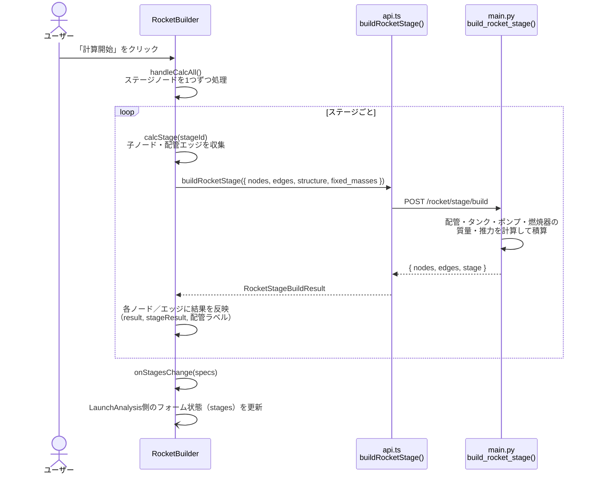
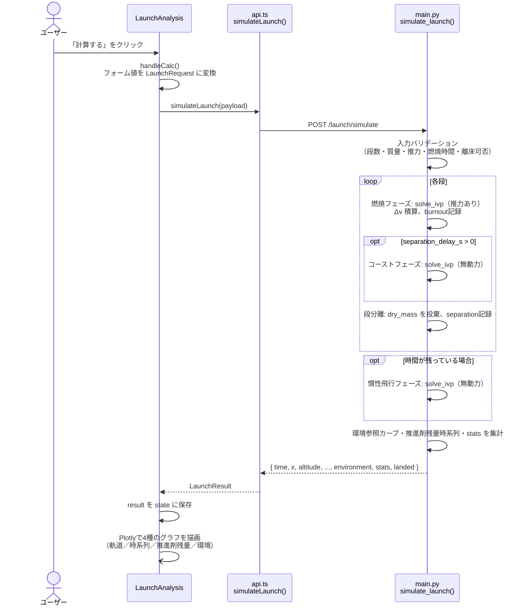

# 打ち上げ解析（打ち上げ解析タブ）計算ロジック

対象: `打ち上げ解析` タブ（[Dashboard.tsx](../../frontend/app/components/Dashboard.tsx) の `tab === 'launch'`）。
[LaunchAnalysis.tsx](../../frontend/app/components/LaunchAnalysis.tsx) が画面全体を構成し、内部に機体設計用の
[RocketBuilder.tsx](../../frontend/app/components/RocketBuilder.tsx) を含む。タブ内には2つの計算ボタンがある。

| ボタン | 場所 | 役割 |
| --- | --- | --- |
| 「計算開始」（段ごとの「計算」も同様） | RocketBuilder（機体設計キャンバス） | 部品グラフ（タンク・ポンプ・燃焼器・配管）から段の質量・推力を算出 |
| 「計算する」 | LaunchAnalysis（左パネル下部） | 各段のスペックから弾道軌道（高度・速度・質量の時間発展）を算出 |

---

## 1. 段の構築計算（RocketBuilder「計算開始」）

### 1.1 概要

機体設計キャンバス上の部品（タンク・ポンプ・燃焼器）と配管（エッジ）、外壁構造材、固定質量から、
段全体の `StageSpec`（乾燥質量・推進剤質量・推力・燃焼時間など）を算出する。

- フロント関数: `calcStage()` / `handleCalcAll()`（[RocketBuilder.tsx:1211](../../frontend/app/components/RocketBuilder.tsx#L1211)）
- API: `buildRocketStage()`（[api.ts:460](../../frontend/app/lib/api.ts#L460)）
- バックエンド: `POST /rocket/stage/build` → `build_rocket_stage()`（[main.py:4078](../../backend/main.py#L4078)）

### 1.2 各部品の計算式

#### 外壁構造材・配管（円筒シェル質量）

$$
m_{shell} = \rho \cdot t \cdot (\pi \cdot D \cdot L)
$$

側面表面積のみを考慮した簡易モデル（底面・座屈は無視）。`_shell_mass()`（main.py:3933）。

#### タンク

- シェル質量: 上記と同じ円筒シェル式（指定肉厚から算出）
- 推進剤質量:

$$
V = \pi \left(\frac{D}{2}\right)^2 L, \qquad
V_{usable} = V \cdot \left(1 - \frac{\text{ullage}\,[\%]}{100}\right), \qquad
m_{propellant} = V_{usable} \cdot \rho_{propellant}
$$

  `propellant_density` は接続された配管エッジの `propellant`（推進剤）から流体ライブラリの密度を自動取得する。
  `_calc_tank()`（main.py:3967）

#### ポンプ・固定質量

- 質量を直接入力値として採用（`massKg` をそのまま使用）。`_calc_direct_mass()`（main.py:3962）

#### 燃焼器（燃焼室＋ノズル一体）

1. **燃焼室肉厚**（薄肉円筒のフープ応力から逆算）

$$
\sigma_{allow} = \frac{\sigma_{yield}}{SF}, \qquad
t = \frac{P_c \cdot D}{2\,\sigma_{allow}}
$$

   `_pressure_vessel_thickness()`（main.py:3942）
2. **燃焼室・ノズルのシェル質量**: 上記円筒シェル式（燃焼室は算出肉厚、ノズルは指定肉厚を使用）
3. **質量流量**（チョークドフロー近似）

$$
\dot{m} = \frac{P_c \cdot A_t}{c^*}
$$

   `_combustor_mdot()`（main.py:3985）
4. **ノズル出口マッハ数**（等エントロピー流れの面積比関係を `brentq` で数値求解）

$$
\frac{A_e}{A_t} = \frac{1}{M} \left[ \frac{2}{\gamma+1} \left(1 + \frac{\gamma-1}{2} M^2\right) \right]^{\frac{\gamma+1}{2(\gamma-1)}}
$$

   超音速側の解（$M > 1$）を探索。`_nozzle_exit_mach()`（main.py:3992）
5. **推力係数 $C_f$・推力・比推力 $I_{sp}$**

$$
\frac{P_e}{P_c} = \left(1 + \frac{\gamma-1}{2} M_e^2\right)^{-\frac{\gamma}{\gamma-1}}
$$

$$
C_f = \sqrt{ \frac{2\gamma^2}{\gamma-1} \left(\frac{2}{\gamma+1}\right)^{\frac{\gamma+1}{\gamma-1}} \left[1 - \left(\frac{P_e}{P_c}\right)^{\frac{\gamma-1}{\gamma}}\right] } + \left(\frac{P_e}{P_c} - \frac{P_{amb}}{P_c}\right) \frac{A_e}{A_t}
$$

$$
F = C_f \cdot P_c \cdot A_t, \qquad
I_{sp} = \frac{F}{\dot{m} \cdot g_0}
$$

   `_calc_combustor()`（main.py:4007）

### 1.3 段全体の集計

各部品の結果を以下のように積算する（`build_rocket_stage()`）。

- `dry_mass` = Σ配管質量 + Σポンプ質量 + Σタンクのシェル質量 + Σ燃焼器のシェル質量 + 外壁構造材質量 + Σ固定質量（ペイロード以外）
- `propellant_mass` = Σタンクの推進剤質量（接続配管の `propellant` 種別から酸化剤/燃料に分類して `oxidizer_mass`/`fuel_mass` も積算）
- `thrust_total` = Σ燃焼器の推力
- `mdot_total` = Σ燃焼器の質量流量
- `burn_time` = `propellant_mass / mdot_total`（`mdot_total` が0なら0）
- `payload_mass` = Σ固定質量（`isPayload = true` のもの）
- `oxidizer` / `fuel` = 燃焼器に接続された配管エッジの `propellant` から決定

結果は既存の `StageSpec` 形式で返され、そのまま「2. 弾道軌道計算」の `stages` 入力として使える。

---

## 2. 弾道軌道計算（LaunchAnalysis「計算する」）

### 2.1 概要

各段のスペック（推進剤質量・乾燥質量・推力・燃焼時間など）と発射角度・空気抵抗設定から、
段の燃焼→コースト→分離を順に処理しながら2次元の弾道軌道（運動方程式）を数値積分する。

- フロント関数: `handleCalc()`（[LaunchAnalysis.tsx:134](../../frontend/app/components/LaunchAnalysis.tsx#L134)）
- API: `simulateLaunch()`（[api.ts:396](../../frontend/app/lib/api.ts#L396)）
- バックエンド: `POST /launch/simulate` → `simulate_launch()`（[main.py:3235](../../backend/main.py#L3235)）

### 2.2 物理モデル

状態ベクトル $[x, y, v_x, v_y, m]$（ダウンレンジ位置・高度・速度成分・質量）に対する運動方程式（`make_ode()`、main.py:3273）。

推力（燃焼中のみ、推力方向は発射角度 $\theta$ に固定）:

$$
F_x = F \cdot \cos\theta, \qquad F_y = F \cdot \sin\theta
$$

空気抵抗（指数大気モデル、$\rho_0=1.225\ \text{kg/m}^3$, $H=8500\ \text{m}$。有効な場合のみ）:

$$
v = |\vec{v}|, \qquad
\rho(h) = \rho_0 \cdot e^{-h/H}, \qquad
F_d = \tfrac{1}{2} \rho(h)\, C_d\, A\, v^2, \qquad
\vec{F}_{drag} = -F_d \cdot \frac{\vec{v}}{v}
$$

運動方程式:

$$
a_x = \frac{F_x + F_{drag,x}}{m}, \qquad
a_y = \frac{F_y + F_{drag,y}}{m} - g(h), \qquad
\frac{dm}{dt} = \begin{cases} -\dot{m} & \text{燃焼中} \\ 0 & \text{無動力時} \end{cases}
$$

- 重力加速度（逆二乗則近似、`_gravity_at_altitude()`、main.py:3193）:

$$
g(h) = \frac{g_0}{\left(1 + h/R_{earth}\right)^2}
$$

- 積分は `scipy.integrate.solve_ivp`（RK45）。着地判定は $y = 0$ をイベント検出（`hit_ground`、main.py:3294）

### 2.3 段ごとの処理フロー（段数分ループ）

各段について以下を順に実行（`simulate_launch()` 内、main.py:3316〜3413）。

1. **燃焼フェーズ**: $\dot{m} = m_{propellant} / t_{burn}$ の一定流量で `burn_time`（または残り時間）だけ積分。
   推力一定・質量減少。燃焼終了時の $\Delta v$ も同時に積算（有効排気速度 $v_e$、ツィオルコフスキーの公式）:

   $$
   v_e = \frac{F}{\dot{m}}, \qquad
   \Delta v \mathrel{+}= v_e \cdot \ln\!\left(\frac{m_{before}}{m_{after}}\right)
   $$

2. **コーストフェーズ**（`separation_delay_s` > 0 の場合）: 無動力（推力0・質量変化なし）で `separation_delay_s` だけ積分。
3. **段分離**: コースト終了時の質量から `dry_mass` を投棄（ペイロード・以降の段は維持）。

全段の処理が終わった後、まだ着地しておらず時間が残っていれば無動力（慣性飛行）で残り時間を積分する。

### 2.4 出発前チェック（バリデーション）

- 段が1つも無い／各段の質量・推力・燃焼時間が0以下 → 400エラー
- 第1段推力の鉛直成分 `thrust × sin(angle)` が機体重量 `mass × g0` 以下 → 離床不可として400エラー

### 2.5 出力される統計値（`stats`）

- `apogee_altitude_m` / `apogee_time_s`: 高度が最大となる点
- `stage_burnouts` / `stage_separations`: 各段の燃焼終了・分離時点の時刻・高度・速度・質量
- `max_speed_ms`, `flight_time_s`, `downrange_m`
- `thrust_to_weight`: 第1段推力 ÷ 初期重量
- `delta_v_ms`: 全段の Δv 合計

また、到達高度に応じた高度参照カーブ（重力加速度・外気圧・外気温の高度依存性、`environment`）と、
各段の推進剤残量の時間変化（`stage_propellant_remaining`、燃焼開始時刻からの経過時間 × mdot を満タン質量から減算）も併せて返す。

---

## 3. フローチャート

### 3.1 「計算開始」（段の構築計算）

```text
[ユーザー: RocketBuilderで「計算開始」をクリック]
        │
        ▼
handleCalcAll()  ── ステージノードを1つずつ処理
        │
        ▼
calcStage(stageId) ループ（ステージごと）
   ├─ 子ノード（タンク／ポンプ／燃焼器）と、子ノード間の配管エッジを収集
   ├─ タンクは接続配管の propellant から流体ライブラリの密度を補完
   └─ buildRocketStage({ nodes, edges, structure, fixed_masses }) を呼ぶ
        │  POST /rocket/stage/build
        ▼
[バックエンド] build_rocket_stage()
   ├─ 配管エッジ: シェル質量計算 → dry_mass に積算
   ├─ ノードをタイプ別に計算
   │    ├─ pump        → 質量を直接採用
   │    ├─ tank         → シェル質量＋推進剤質量（円筒体積×密度）
   │    └─ combustor     → 燃焼室肉厚→シェル質量、mdot、推力・Isp算出
   ├─ 外壁構造材のシェル質量を加算
   ├─ 固定質量を dry_mass／payload_mass に振り分け
   └─ stage = { propellant_mass, dry_mass, payload_mass, thrust, burn_time, mdot_total, ... }
        │  レスポンス: { nodes, edges, stage }
        ▼
[フロントエンド] 各ノード／エッジに計算結果を反映（result, stageResult, 配管ラベル）
        │
        ▼
onStagesChange(specs) で LaunchAnalysis 側のフォーム状態（stages）を更新
```



### 3.2 「計算する」（弾道軌道計算）

```text
[ユーザー: LaunchAnalysisで「計算する」をクリック]
        │
        ▼
handleCalc()
   ├─ フォーム値（stages, payload_mass, launch_angle, drag設定, duration, dt）を
   │   LaunchRequest に変換
   └─ simulateLaunch(payload) を呼ぶ
        │  POST /launch/simulate
        ▼
[バックエンド] simulate_launch()
   ├─ 入力バリデーション（段数・質量・推力・燃焼時間・離床可否）
   ├─ 初期質量・初期状態 [x=0, y=0, vx=0, vy=0, m=initial_mass] を設定
   │
   ├─ 各段についてループ:
   │    ├─ 燃焼フェーズ: solve_ivp（推力あり・質量減少）→ Δv 積算、burnout記録
   │    ├─ （着地イベント検出で即終了）
   │    ├─ コーストフェーズ（separation_delay_s > 0 のとき）: solve_ivp（無動力）
   │    └─ 段分離: dry_mass を投棄、separation記録
   │
   ├─ 全段終了後、時間が残っていれば慣性飛行フェーズを solve_ivp（無動力）
   │
   ├─ 環境参照カーブ（重力・外気圧・外気温 vs 高度）を生成
   ├─ 各段の推進剤残量の時系列を算出
   └─ stats（最大到達高度・最大速度・Δv・推力重量比など）を集計
        │  レスポンス: { time, x, altitude, vx, vy, speed, mass,
        │                stage_propellant_remaining, environment, stats, landed }
        ▼
[フロントエンド] result を state に保存
        │
        ▼
Plotlyで4種のグラフを描画
   ├─ 飛行軌道（ダウンレンジ–高度、段分離マーカー付き）
   ├─ 時系列（高度／速度／質量の切替表示）
   ├─ 各段の推進剤残量の時間変化
   └─ 環境（重力加速度・外気圧・外気温 vs 高度、最大到達高度マーカー付き）
```


